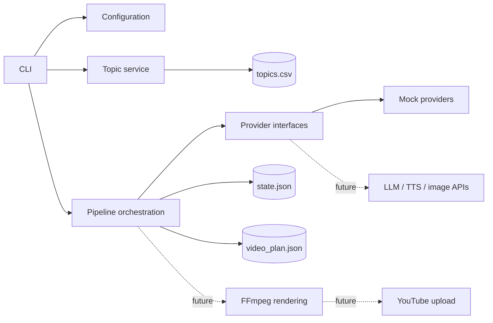

# YouTube Automation

A modular Python project for building a resumable pipeline that produces
educational, faceless YouTube videos. Python coordinates the workflow while
replaceable providers generate content and FFmpeg performs media processing.

> [!IMPORTANT]
> The repository currently contains **Phase 1**. Configuration, validated video
> plans, atomic topic selection, pipeline state, mock planning, and the CLI work.
> Audio, images, rendering, quality checks, resume commands, and YouTube upload
> are on the roadmap and are not yet implemented.

## Current Features

- Python 3.11+ package using a `src` layout and type hints.
- Strict YAML configuration validation with Pydantic v2.
- Structured `VideoPlan`, `Scene`, and `ThumbnailPlan` models.
- Sequential scene ID, metadata length, URL, and duplicate-tag validation.
- Priority-based topic selection from `topics.csv`.
- Atomic CSV and JSON writes to reduce corruption after interruption.
- Filesystem-safe, unique run IDs and per-run output directories.
- Deterministic mock LLM provider that requires no API key or network access.
- Unit tests for configuration, models, topic handling, and pipeline state.

## Architecture



Provider protocols keep business logic independent from a specific AI vendor.
Mock providers make local development and tests deterministic and free of paid
API calls.

## Project Structure

```text
.
|-- config.yaml                 # Local non-secret defaults
|-- config.example.yaml         # Configuration template
|-- topics.csv                  # Topic queue
|-- prompts/                    # External prompt templates
|-- src/youtube_automation/
|   |-- cli.py                  # Command-line entry point
|   |-- config.py               # YAML and environment validation
|   |-- models.py               # Structured video-plan models
|   |-- state.py                # Atomic pipeline state
|   |-- providers/              # Provider contracts and mocks
|   |-- services/               # Topic and pipeline services
|   `-- utils/                  # Shared filesystem helpers
|-- tests/                      # Unit tests
`-- output/                     # Generated runs; ignored by Git
```

## Requirements

For Phase 1:

- Python 3.11 or newer
- pip
- Git

Future media phases will also require FFmpeg and ffprobe. They are not needed
for the current mock planning workflow.

## Installation

### Ubuntu or WSL

```bash
python3 --version
python3 -m venv .venv
source .venv/bin/activate
python -m pip install --upgrade pip
python -m pip install -e '.[dev]'
```

For future rendering support:

```bash
sudo apt update
sudo apt install ffmpeg
ffmpeg -version
ffprobe -version
```

### Windows PowerShell

```powershell
py -3.11 -m venv .venv
.\.venv\Scripts\Activate.ps1
python -m pip install --upgrade pip
python -m pip install -e ".[dev]"
```

For future rendering support, install FFmpeg with `winget` and open a new
terminal afterward:

```powershell
winget install Gyan.FFmpeg
ffmpeg -version
ffprobe -version
```

### macOS

```bash
python3 -m venv .venv
source .venv/bin/activate
python -m pip install --upgrade pip
python -m pip install -e '.[dev]'
brew install ffmpeg
```

Optional dependency groups can be installed as their phases are implemented:

```bash
python -m pip install -e '.[dev,media,youtube]'
```

## Configuration

`config.yaml` stores non-secret settings. Its main sections are:

| Section | Purpose |
| --- | --- |
| `channel` | Channel name, language, category, privacy, and audience setting |
| `video` | Resolution, frame rate, and accepted duration range |
| `scenes` | Scene-count and on-screen-text limits |
| `pipeline` | Output location, retries, intermediate files, and upload defaults |

To restore the sample configuration:

```bash
cp config.example.yaml config.yaml
```

Secrets belong in environment variables, never in `config.yaml`. Copy the
provided names and fill values only when their providers are implemented:

```bash
cp .env.example .env
```

The recognized variables are `LLM_API_KEY`, `LLM_MODEL`, `TTS_API_KEY`,
`TTS_MODEL`, `TTS_VOICE_ID`, `IMAGE_API_KEY`, `IMAGE_MODEL`,
`YOUTUBE_CLIENT_SECRETS_FILE`, and `YOUTUBE_TOKEN_FILE`.

`.env`, OAuth client files, and token files are ignored by Git.

## Usage

Show all available commands:

```bash
python -m youtube_automation --help
python -m youtube_automation run --help
```

List the topic queue without changing it:

```bash
python -m youtube_automation list-topics
```

Generate a mock plan for the highest-priority pending topic without claiming
that topic:

```bash
python -m youtube_automation run --mock-providers --dry-run --no-upload
```

Generate a mock plan for a topic supplied directly on the command line:

```bash
python -m youtube_automation run \
	--topic "How Secure Boot Protects Firmware" \
	--mock-providers \
	--dry-run \
	--no-upload
```

Use a different configuration file by placing the global option before the
subcommand:

```bash
python -m youtube_automation --config config.example.yaml list-topics
```

In Phase 1, `--mock-providers` is required. The `--privacy` and `--no-upload`
options establish the future CLI contract; no upload is currently attempted.
Public uploads will require an explicit `--privacy public` argument when upload
support is added, and private will remain the default.

## Topic Queue

`topics.csv` contains these columns:

```text
topic_id,title,audience,status,priority,created_at,completed_at,run_id
```

Valid statuses are `pending`, `processing`, `completed`, and `failed`. A normal
non-dry run claims the highest numeric-priority pending row, marks it
`processing`, and associates it with the run ID. Dry runs and explicitly
provided topics do not modify the queue.

Use stable, filesystem-safe values for `topic_id`. Do not add confidential
company information, proprietary implementation details, or copied scripts.

## Generated Output

Each invocation creates a unique directory under `output/`:

```text
output/
`-- 20260830-120000-queued-topic-a1b2/
		|-- state.json
		`-- video_plan.json
```

`video_plan.json` contains validated metadata and five deterministic mock
scenes. `state.json` records stage status, timestamps, attempt count, and output
paths. Writes use a temporary file followed by an atomic replacement.

Later phases will add `audio/`, `images/`, `clips/`, `subtitles/`, `thumbnail/`,
`logs/`, and `final/` directories within each run.

## Testing

Run the complete current suite:

```bash
python -m pytest
```

Run with coverage:

```bash
python -m pytest --cov=youtube_automation --cov-report=term-missing
```

Tests never call paid providers or upload content.

## Security and Content Rules

- Keep `.env`, API keys, OAuth tokens, and client-secret files out of Git.
- Never execute model-generated code or render arbitrary untrusted HTML.
- Do not download arbitrary URLs returned by a model.
- Do not clone a person's voice without consent.
- Use licensed music and original or properly licensed visual material.
- Do not copy articles or other videos verbatim.
- Do not include confidential employer or customer information in prompts.
- Do not upload when validation or quality checks fail.
- Review synthetic-media disclosure and originality requirements before publishing.

## Roadmap

1. Add real LLM generation, correction, and review providers.
2. Add per-scene TTS and image providers with retry and caching behavior.
3. Generate subtitles, animated scene clips, final video, and thumbnail.
4. Add media and metadata quality reports.
5. Add resumable private YouTube uploads with duplicate-upload protection.
6. Complete integration tests and production operations documentation.

## Troubleshooting

**`Configuration file not found`**

Run from the repository root and ensure `config.yaml` exists. Restore it from
`config.example.yaml` if necessary.

**`No pending topics are available`**

Add a `pending` row to `topics.csv`, change an appropriate failed row back to
`pending`, or pass `--topic` directly.

**The package cannot be imported**

Activate the project virtual environment and rerun
`python -m pip install -e '.[dev]'`.

**Git reports dubious ownership in a WSL workspace**

Prefer running Git inside WSL. If Windows Git must access the directory, mark
only this repository as safe rather than trusting every directory globally.

## Cost Control

Use mock providers while developing orchestration and tests. Before enabling
real APIs, set bounded retries, provider timeouts, output-size limits, and model
names in configuration. Keep upload disabled until a complete run passes all
quality checks.

## License

No license has been selected yet. Until one is added, the repository remains
all rights reserved by its owner.
